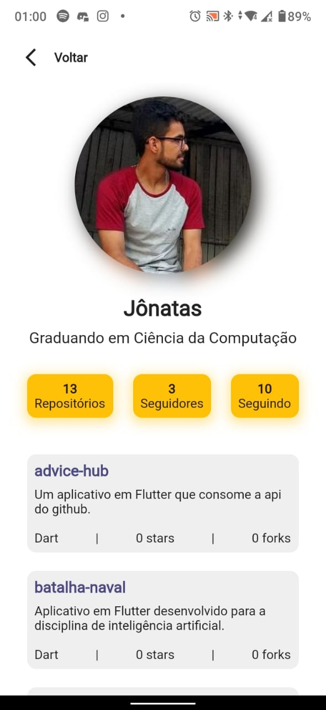

<h1 align="center">
    
    <br>
    AdviceHub
</h1>

<h4 align="center">
    Projeto desenvolvido em Flutter utilizando a linguagem Dart, consiste em um aplicativo que consome a <a href="https://api.github.com"
    itemprop="url">api do GitHub</a> para mostar informações sobre usuários e seus repositórios.
</h4>

<p align="center">

  

  

  

  

</p>

<p align="center">
  <a href="#rocket-technologies">Tecnologias</a>&nbsp;&nbsp;&nbsp;|&nbsp;&nbsp;&nbsp;
  <a href="#information_source-how-to-use">Como Executar</a>&nbsp;&nbsp;&nbsp;|&nbsp;&nbsp;&nbsp;
  <a href="#information_source-structure">Estrutura e Etapas</a>&nbsp;&nbsp;&nbsp;|&nbsp;&nbsp;&nbsp;
  <a href="#memo-license">Licença</a>&nbsp;&nbsp;&nbsp;|&nbsp;&nbsp;&nbsp;
  <a href="#octocat-author">Autor</a>
</p>


<p align="center">
  
</p>

<p align="center">
  
</p>

<p align="center">
  
</p>

<p align="center">
  
</p>

<p align="center">
  
</p>

<p align="center">
  
</p>


## :rocket: Tecnologias

-  [Flutter](https://flutter.dev/)
-  [Dart](https://dart.dev/)
-  [Slidy](https://github.com/Flutterando/slidy)
-  [Dio](https://pub.dev/packages/dio)
-  [Mobx](https://pub.dev/packages/mobx)
-  [Modular](https://github.com/Flutterando/modular)
-  [VS Code][vc]

## :information_source: Como Executar

Para executar essa aplicação você pode [baixar o apk aqui](https://github.com/JonsCarvalho/advice-hub/releases/download/1.0.0/advice-hub-app-release.apk). Para instalar em seu dispositivo android, basta habilitar fontes desconhecidas. Ou se preferir pode instalar em um emulador android como o [Bluestacks](https://www.bluestacks.com/pt-br/index.html).

Ou

Para clonar e executar essa aplicação, você irá precisar do [Git](https://git-scm.com) + [Flutter](https://flutter.dev/) + [VS Code][vc] instalados no seu computador. Na sua linha de comando:


```bash
# Clone esse repositório
$ git clone <https://github.com/JonsCarvalho/advice-hub>

# Vá para o repositório
$ cd advice-hub

# Abra no VS Code
$ code .

# Execute
$ flutter run # ou tecle F5


```

## :information_source: Estrutura e Etapas

- Estrutura

A primeira etapa foi definir a estrutura do projeto, optei por utilizar a CLI Slidy para automatizar o processo de criação da estrutura. 

Escolhi o Modular como provedor, para injeção de dependências, sistema de roteamento e gerenciamento do uso de memória do aplicativo (através do descarte do módulo injetado de forma automática, quando está fora do escopo).

"A estrutura modular consiste em módulos desacoplados e independentes que representarão as funcionalidades da aplicação. Cada módulo está localizado em seu próprio diretório e controla suas próprias dependências, rotas, páginas, widgets e lógica de negócios".

- Design Pattern

A estrutura utilizada é similar ao MVC, além disso também é utilizado o conceito de repository pattern. Sendo assim, temos uma estrutura de pastas organizada em módulos locais e um módulo global. As dependências (repositórios, controllers, modelos, etc) podem ser acessadas em todo o aplicativo.

- Gerenciador de estados

Para gerenciamento de estados optei pelo Mobx. Um state-management que facilita a conexão dos dados reativos do aplicativo com a IU.

- Utilização de Packages

Alguns packages merecem menção, são eles: 

[dio](https://pub.dev/packages/dio) para fazer todas as requisições get, 
[flutter_svg](https://pub.dev/packages/flutter_svg) para renderização de imagens SVG, 
[font_awesome_flutter](https://pub.dev/packages/font_awesome_flutter) fonte de ícones de toda a aplicação, 
[google_fonts](https://pub.dev/packages/google_fonts) daqui veio a fonte Roboto, 
[animated_text_kit](https://pub.dev/packages/animated_text_kit) utilizado para animar o texto da Splash screen.

- O Projeto

É composto por três páginas e seus respectivos módulos, sendo eles o módulo da splash screen, o módulo de login e o módulo profile.

A página splash mostra apenas uma animação com a logo e o nome do app, e em seguida redireciona para o módulo de login. No módulo de login temos a página e o seu controller, que é onde se faz todo o controle do input do usuário. No módulo profile, temos a página, o controller (por aqui se faz o controle de chamadas das funções responsáveis pela busca dos dados, além de receber os dados do repositório), o repositório (aqui são feitas as requisições para busca dos dados da api), o profile model (um modelo para os dados de cada usuário) e o repositories model (um modelo para os dados de cada repositório).

## :memo: Licença

Este projeto está sob a licença MIT. Veja a [LICENSE](https://github.com/JonsCarvalho/advice-hub/blob/main/LICENSE.md) para mais informações.

## :octocat: Autor

<a href="https://github.com/JonsCarvalho/">
 
 <br />
 <sub><b>Jônatas Carvalho</b></sub>
</a>

Feito com :heart: por Jônatas Moreira de Carvalho :vulcan_salute:

[](https://www.facebook.com/J.o.n.a.t.a.s.C.a.r.v.a.l.h.o.w/) [](https://www.instagram.com/jonscarvalho/) [](https://www.linkedin.com/in/jonscarvalho/) [](mailto:jonatascarvalhow@gmail.com)

[api]: https://api.github.com
[vc]: https://code.visualstudio.com/